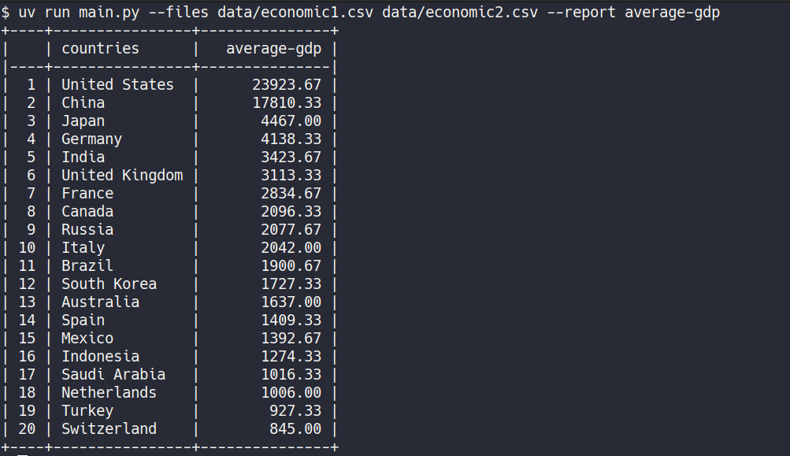

## Как запустить

```bash
python -m venv .venv
source .venv/bin/activate  # .venv\Scripts\activate на Windows
pip install -r requirements.txt

pytest  # для запуска тестов

python main.py --files data/economic1.csv data/economic2.csv --report average-gdp
```

Или через `uv`:

```bash
uv sync

uv run pytest  # для запуска тестов

uv run main.py --files data/economic1.csv data/economic2.csv --report average-gdp
```

## Пример работы




## Как добавить новый тип отчёта

1. Создать новый класс в файле `reports.py` (например, `PopulationChangeReport`), который должен наследоваться от `Report`. В новом классе должен быть реализован метод `generate_report` (при необходимости можно переписать и другие методы).

2. Добавить название типа отчёта и новый класс в словарь `REPORTS` в файле `main.py`. Например:

```python
from reports import AverageGDPReport, PopulationChangeReport

REPORTS = {
    "average-gdp": AverageGDPReport,
    "population-change": PopulationChangeReport,
}
```
